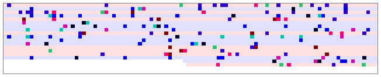
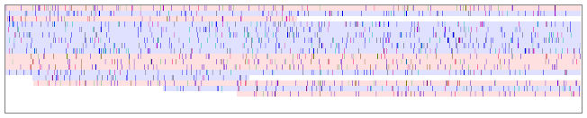
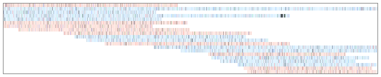
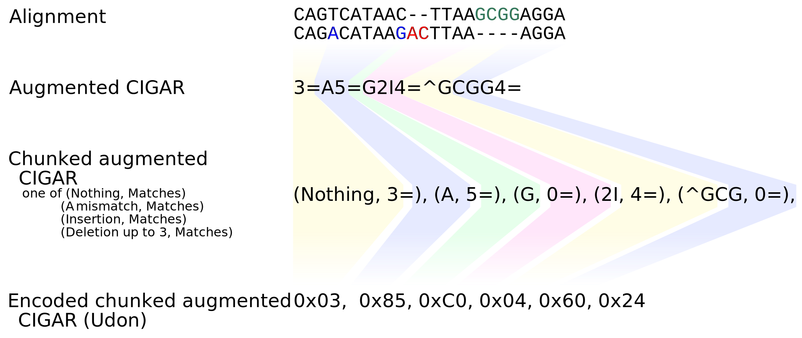

# Udon — caching BAM CIGAR strings for visualization

**Udon** is a tiny library transcoding [BAM CIGAR / MD strings](https://samtools.github.io/hts-specs/) and query sequence into a single augumented compressed CIGAR object. The augumented data structure, along with an index to locate substring positions, assists quick drawing of alignment ribbon of arbitrary span with arbitrary scaling. It achieves ~1 bit/column compression density and ~2G columns/sec. (per alignment) decompression throughput on typical real-world Illumina and Nanopore datasets.

## Examples

```Rust
/* prepare scaler and color palette (10 columns (bases) per pixel) */
let scaler = UdonScaler::new(&UdonPalette::default(), 10.0);
let base_color: [[u8; 4]; 2] = [[255, 191, 191, 0], [191, 191, 255, 0]];

/* for each alignment... */
let mut record = Record::new();
while let Ok(true) = reader.read_into(&mut record) {
	if !record.flag().is_mapped() { continue; }

	/* construct indexed ribbon (udon) for the alignment record */
	let cigar = record.cigar().raw();
	let query = record.sequence().raw();
	let mdstr = if let Some(TagValue::String(s, _)) = record.tags().get(b"MD") { s } else { panic!("") };
	let udon = Udon::build(&cigar, &query, &mdstr).unwrap();

	/* slice ribbon scaled */
	let decode_range = Range<usize> { start: 0, end: udon.reference_span() };
	let mut ribbon = udon.decode_scaled(&decode_range, 0.0, &scaler).unwrap();

	/* put forward / reverse color then apply gamma correction */
	ribbon.append_on_basecolor(base_color[record.flag().is_reverse_strand() as usize]).correct_gamma();

	/* here we obtained alignment ribbon in RGBa8 format */
  do_something_with(ribbon);
}
```

Pileups with different scales, drawn by [ribbon.rs](https://github.com/ocxtal/udon/blob/devel/examples/ribbon.rs):







*Figure1: 100 columns per 640 pixels (top) to 10,000 columns per 640 pixels.*

## Requirements

* Rust >= **1.33.0**
* **x86\_64** with SSE4.2 / AVX2 or **AArch64** with NEON

*Notes: **1**. The library is not yet published to crates.io. You would need to tell cargo to fetch it directly from github.com as `udon = "github.com/ocxtal/udon.git"`. See [Cargo.toml documentation](https://doc.rust-lang.org/cargo/reference/specifying-dependencies.html#specifying-dependencies-from-git-repositories) for the details. **2.** Nightly toolchain is required for AArch64 target.*

## APIs

### Construction (transcode)

```rust
impl<'i, 'o> Udon<'o> {
	pub fn build(cigar: &'i [u32], packed_query: &'i [u8], mdstr: &'i [u8]) -> Option<Box<Udon<'o>>>;
}
```

We expect `cigar`, `packed_query`, and `mdstr` are those parsed by [bam](https://docs.rs/bam/0.1.0/bam/) crate. See [example](https://github.com/ocxtal/udon/blob/devel/examples/ribbon.rs) for the details.

### Retrieving metadata

```rust
impl<'o> Udon<'o> {
	pub fn reference_span(&self) -> usize;
}
```

Returns reference side span, excluding soft- and hard-clips at the both ends.

### Decode

```rust
impl<'o> Udon<'o> {
	pub fn decode_raw(&self, ref_range: &Range<usize>) -> Option<Vec<u8>>;
	pub fn decode_scaled(&self, ref_range: &Range<usize>, offset_in_pixels: f64, scaler: &UdonScaler) -> Option<Vec<u32>>;
}
```

Decode udon into an array of columns or an alignment ribbon. `decode_raw` does the former, placing one `UdonOp` for each byte of the output Vec. When the alignment has an insertion, `UdonOp::Ins` is OR'ed at a column just after the insertion.

`decode_scaled` does the latter, first calling `decode_raw` then applying scaling procedure. It adopts approximated Lanzcos (sinc) interpolation for scaling factor (columns / pixel) larger than 1.0.

#### Color handling in scaled decoder

```rust
pub struct UdonPalette {
	/* all in (r, g, b, unused) form */
	background:  [u8; 4],
	del: [u8; 4],
	ins: [u8; 4],
	mismatch: [[u8; 4]; 4]
}

impl UdonScaler {
	pub fn new(color: &UdonPalette, columns_per_pixel: f64) -> UdonScaler;
}

impl UdonUtils for [u32] {
	fn append_on_basecolor(&mut self, basecolor: [u8; 4]) -> &mut Self;
	fn correct_gamma(&mut self) -> &mut Self;
}
```

`UdonScaler::new()` creates a constant pool for the scaled decoder. It takes color palette along with the scaling factor (columns / pixel constant). Each color in the palette is in (R, G, B, -) format where R comes first element (= placed at the LSB). The output color array of the scaled decoder contains **negated sum** of the column colors, and **should be overlaid onto base color** using `append_on_basecolor`. Additionally it provides gamma correction function (gamma = 2.2) for direct use of the output array for plotting.

### Querying insertion

```rust
impl<'o> Udon<'o> {
	pub fn get_ins(&self, pos: usize) -> Option<Vec<u8>>;
}
```

Returns inserted sequence at `UdonOp::Ins` position. Output sequence is encoded in ASCII.

## Augumented CIGAR string: format and decompression algorithm

Udon constructs an "augumented CIGAR string" from the original BAM CIGAR, MD tag, and query-side sequence. The augumented CIGAR string is an extension of the original CIGAR string that explicitly expresses query-side bases at mismatch and insertion positions so that bases different or missing from the reference sequence are not lost.

Udon uses a run-length encoding to keep the augumented CIGAR string in a compressed way. Up to thirty "events" of match, mismatch, insertion, or deletion are packed into a single byte, called "op." The series of events packed into a single op is called "chunk."

### Op structure

Op is designed for fastest decompression and smallest footprint. Actual op structure is a pair of (bit-) fields, 3 bits for **leading event** and 5 bits for **total span**.

* **Leading event** encodes one of mismatch, deletion, or insertion at the head of the chunk. Three bits from MSb are assigned to this field.
  * **0b000** represents **insertion**, it only indicates there is an inserted sequence between it and its preceeding chunk. The actual sequence is stored outside the op stream and retrieved by calling another API.
  * **0b001 - 0b011** represent **deletion**, it encodes the number of deleted columns: one to three bases. Deletion longer than three bases is divided into multiple ops.
  * **0b100 - 0b111** represent **mismatch**, it encodes a single base on query. Value 0x04 to 0x07 represent 'A', 'C', 'G', and 'T', respectively.
* **Total span** is the reference sequence length that are covered by the chunk, including the leading event(s). Lower 5-bit is assinged to the field, expressing 0 to 30 columns. The value 31 is a special value for "continuing match", where its actual length is 30 and match events continue to the next chunk without any insertion, deletion, or mismatch. The value zero only appears when an insertion is followed by a mismatch or deletion.



*Figure 2. Illustration of compression: the original (flat) augumented CIGAR string, built from alignment, is divided into chunks, and each chunk is encoded as an op, a pair of leading event and total span.*

### Expanding ops into ribbon

Decompression is a procedure to convert op stream back to the original array of events. Since each op encodes up to 30 events in a run-length manner, the entire event array is obtained by concatenating successive results of op-to-chunk conversion.

A trick for fast decompression is here; dividing the conversion procedure into the following two disjoint subprocedures:

* **Composing 32-column-length event array:** A constant-length vector is constructed from the input op, with up to three leading "special" events and trailing (up to 31) match events. Since match event is represented by 0x00 in the output array, placing the trailing match events is just clearing the columns. The entire operation is done on SIMD registers within ten or less instructions.
* **Clipping the array to the chunk length:** Clipping the constant-length vector is done *after* storing it to the output array by forwarding the output array pointer by the chunk length.

Since the two procedures are independent, they are executed without waiting for each other. On most modern processors, the bottleneck is the vector construction process. Latencies for forwarding pointers and storing vectors are successfully hidden, because the operations are accompanied by no further operation and handled by huge store queue and store buffer. Taken together, it achieves burst conversion at around 10 cycles per loop on typical modern processors like AMD Zen2.

### Scaled decompression

Scaling of alignment ribbon is essential for visualization. Udon provides unified decomression-and-scaling API that require no external intermediate buffer. The implementation is quite straightforward; it divides the queried range into multiple constant-length subranges (16 KB by default), and apply decompression and scaling procedures one by one using a single intermediate buffer. The default subrange length was determined so that the buffer won't spill out of the last-level (L3) data cache. Everything done on L3 cache, the conversion throughput won't be impaired.

## Copyright and License

Hajime Suzuki (2020), licensed under MIT.