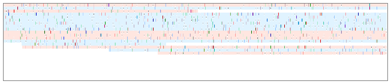
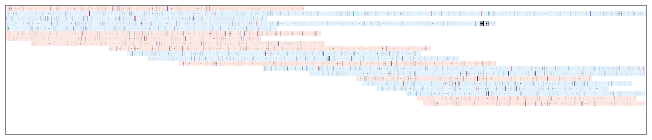

# Udon — caching BAM CIGAR strings for visualization

**Udon** is a tiny library transcoding [BAM CIGAR / MD strings](https://samtools.github.io/hts-specs/) and query sequence into a single augmented compressed CIGAR object. The augmented data structure, along with an index to locate substring positions, assists quick drawing of alignment ribbon of arbitrary span with arbitrary scaling. It achieves ~1 bit / column compression density and ~2G columns / sec. (per alignment) decompression throughput on typical real-world Illumina and Nanopore datasets.

### What Udon can do are:

* Converting a BAM alignment record (both CIGAR and MD strings required) into a monolithic `Udon` object.
* Keeping all the information of mismatches, insertions, and deletions in the `Udon` object, including what the query-side bases for mismatches or insertions are.
* Slicing alignment record at arbitrary range, and decoding it into an alignment string (equivalent to an alignment string like `"MMMDDMMMCMMMTC"`; encoded as `UdonOp`s) or an alignment ribbon (an array of RGB-alpha's).
* Fetching insertion sequence located at a specific position (which is indicated by `UdonOp::Ins` flag), and returning it as ASCII string.

## Examples

```Rust
/* prepare scaler and color palette (10 columns (bases) per pixel) */
let scaler = UdonScaler::new(&UdonPalette::default(), 10.0);
let base_color: [[[u8; 4]; 2]; 2] = [
	[[255, 202, 191, 255], [255, 255, 255, 255]],
	[[191, 228, 255, 255], [255, 255, 255, 255]]
];

/* for each alignment... */
let mut record = Record::new();
while let Ok(true) = reader.read_into(&mut record) {
	if !record.flag().is_mapped() { continue; }

	/* construct indexed ribbon (udon) for the alignment record */
	let cigar = record.cigar().raw();
	let query = record.sequence().raw();
	let mdstr = if let Some(TagValue::String(s, _)) = record.tags().get(b"MD") { s } else { panic!("") };
	let udon = Udon::build(&cigar, &query, &mdstr).unwrap();

	/* slice ribbon scaled */
	let decode_range = Range::<usize> { start: 0, end: udon.reference_span() };
	let mut ribbon = udon.decode_scaled(&decode_range, 0.0, &scaler).unwrap();

	/* put forward / reverse color then apply gamma correction */
	ribbon.append_on_basecolor(&base_color[record.flag().is_reverse_strand() as usize]).correct_gamma();

	/* here we obtained alignment ribbon in [RGBa8; 2] (= [[u8; 4]; 2]) array */
	do_something_with(ribbon);
}
```

Pileups at different scales, drawn by [ribbon.rs](https://github.com/ocxtal/udon/blob/devel/examples/ribbon.rs):






*Figure1: 100 (top), 1000 (middle), and 10000 (bottom) columns per 640 pixels.*

## Requirements

* Rust >= **1.33.0**
* **x86\_64** with SSE4.2 / AVX2

*Note: The library is not yet published to crates.io. You would need to tell cargo to fetch it directly from github.com as `udon = "github.com/ocxtal/udon.git"`. See [Cargo.toml documentation](https://doc.rust-lang.org/cargo/reference/specifying-dependencies.html#specifying-dependencies-from-git-repositories) for the details.*

## APIs

### Construction (transcode)

```rust
impl<'i, 'o> Udon<'o> {
	pub fn build(cigar: &'i [u32], packed_query: &'i [u8], mdstr: &'i [u8]) -> Option<Box<Udon<'o>>>;
	pub fn build_alt(cigar: &'i [u32], packed_query_full: &'i [u8], mdstr: &'i [u8]) -> Option<Box<Udon<'o>>>;
}
```

Builds an `Udon` object. We assume `cigar`, `packed_query`, and `mdstr` are those parsed by [bam](https://docs.rs/bam/0.1.0/bam/) crate. The first function `build` is for complete BAM records with appropriate query field, and the second function `build_alt` is for records that lack their query sequence. In the latter case, the `packed_query_full` argument should be one parsed from the primary alignment that have full-length query sequence. See [example](https://github.com/ocxtal/udon/blob/devel/examples/ribbon.rs) for a simple usage of the `build` function.

*Note: The two functions behave exactly the same for a primary alignment record whose overhangs are encoded as soft clips. The difference of two functions matters only when clips are hard.*

### Retrieving metadata

```rust
impl<'o> Udon<'o> {
	pub fn reference_span(&self) -> usize;
}
```

Returns reference side span, excluding soft- and hard-clips at the both ends.

### Decode

```rust
pub type UdonColorPair = [[u8; 4]; 2];	/* [(r, g, b, alpha); 2] */

impl<'o> Udon<'o> {
	pub fn decode_raw(&self, ref_range: &Range<usize>) -> Option<Vec<u8>>;
	pub fn decode_scaled(&self, ref_range: &Range<usize>, offset_in_pixels: f64, scaler: &UdonScaler) -> Option<Vec<UdonColorPair>>;
}
```

Decodes `Udon` into an array. The array consists of alignment edits (for `decode_raw`; see `UdonOp` for the definition of the edits), or is alignment ribbon (an array of RGB-alpha pairs; for `decode_scaled`).

For the `decode_raw`, each column (one column per one reference-side base) keeps one or two alignment edit(s). When it has two edits, the first one is an insertion. The other (and single edit case) is either mismatch or deletion. For the mismatches, `UdonOp` distinguishes bases and reports what the query-side base was.

For the `decode_scaled`, each array element keeps color for one or more alignment edits, depending on the value of the scaling factor (`columns_per_pixel` embedded in `UdonScaler`; see below for the details). For example, when `columns_per_pixel` is 3.0, each element is a blend of three edits. The `offset_in_pixels` adjust the fractional position of the ribbon when the start position (the first column) is not aligned to the multiple of the scaling factor. When `columns_per_pixel` is 3.0 and the start position (offset from the left boundary; measured on the reference side) is 10.0, the `offset_in_pixels` should be 0.3333... (= 10.0 % 3.0).

#### Color handling in scaled decoder

```rust
pub type UdonColorPair = [[u8; 4]; 2];	/* [(r, g, b, alpha); 2] */

pub struct UdonPalette {
	/* all in [(r, g, b, alpha); 2] form; the larger alpha value, the more transparent */
	background:  UdonColorPair,
	del: UdonColorPair,
	ins: UdonColorPair,
	mismatch: [UdonColorPair; 4]
}

impl UdonScaler {
	pub fn new(color: &UdonPalette, columns_per_pixel: f64) -> UdonScaler;
}

impl UdonUtils for [UdonColorPair] {
	fn append_on_basecolor(&mut self, basecolor: &UdonColorPair) -> &mut Self;
	fn correct_gamma(&mut self) -> &mut Self;
}
```

`UdonScaler::new()` creates a constant pool for the scaled decoder. It takes color palette along with the scaling factor (columns / pixel; constant). Each color in the palette is in (R, G, B, -) format where R comes first element (= placed at the LSB). The output color array of the scaled decoder contains **negated sum** of the column colors, and **should be overlaid onto base color** using `append_on_basecolor`. Additionally it provides gamma correction function (gamma = 2.2) for direct use of the output array for plotting.

#### Drawing deletion bars

The two color channels can be used for drawing "deletion bars", as in Figure 1. The first channel renders deletion with white and the second with gray. The other colors being the same, the resulting channels are different only at deletions. Putting the second channel at the center of the ribbon makes the deletion drawn as bars.

*I'm planning to add another channel for insertion markers. To make the channel configuration more elastic, I'm waiting for the const generics, which is to be stable in Rust 2020.*

### Querying insertion

```rust
impl<'o> Udon<'o> {
	pub fn get_ins(&self, pos: usize) -> Option<Vec<u8>>;
}
```

Returns inserted sequence at `UdonOp::Ins` position. Output sequence is encoded in ASCII.

## Augmented CIGAR string: format and decompression algorithm

Udon constructs an "augmented CIGAR string" from the original BAM CIGAR, MD tag, and query-side sequence. The augmented CIGAR string is an extension of the original CIGAR string that explicitly expresses query-side bases at mismatch and insertion positions so that bases different or missing from the reference sequence are not lost.

Udon uses a run-length encoding to keep the augmented CIGAR string in a compressed way. Up to thirty "events" of match, mismatch, insertion, or deletion are packed into a single byte, called "op." The series of events packed into a single op is called "chunk."

### Op structure

Op is designed for fastest decompression and smallest footprint. Actual op structure is a pair of (bit-) fields, 3 bits for **leading event** and 5 bits for **total span**.

* **Leading event** encodes one of mismatch, deletion, or insertion at the head of the chunk. Three bits from MSb are assigned to this field.
  * **0b000** represents **insertion**, it only indicates there is an inserted sequence between it and its preceeding chunk. The actual sequence is stored outside the op stream and retrieved by calling another API.
  * **0b001 - 0b011** represent **deletion**, it encodes the number of deleted columns: one to three bases. Deletion longer than three bases is divided into multiple ops.
  * **0b100 - 0b111** represent **mismatch**, it encodes a single base on query. Value 0x04 to 0x07 represent 'A', 'C', 'G', and 'T', respectively.
* **Total span** is the reference sequence length that are covered by the chunk, including the leading event(s). Lower 5-bit is assinged to the field, expressing 0 to 30 columns. The value 31 is a special value for "continuing match", where its actual length is 30 and match events continue to the next chunk without any insertion, deletion, or mismatch. The value zero only appears when an insertion is followed by a mismatch or deletion.


*Figure 2. Illustration of compression: the original (flat) augmented CIGAR string, built from alignment, is divided into chunks, and each chunk is encoded as an op, a pair of leading event and total span.*

### Expanding ops into ribbon

Decompression is a procedure to convert op stream back to the original array of events. Since each op encodes up to 30 events in a run-length manner, the entire event array is obtained by concatenating successive results of op-to-chunk conversion.

A trick for fast decompression is here; dividing the conversion procedure into the following two disjoint subprocedures:

* **Composing 32-column-length event array:** A constant-length vector is constructed from the input op, with up to three leading "special" events and trailing (up to 31) match events. Since match event is represented by 0x00 in the output array, placing the trailing match events is just clearing the columns. The entire operation is done on SIMD registers within ten or less instructions.
* **Clipping the array to the chunk length:** Clipping the constant-length vector is done *after* storing it to the output array by forwarding the output array pointer by the chunk length.

Since the two procedures are independent, they are executed without waiting for each other. On most modern processors, the bottleneck is the vector construction process. Latencies for forwarding pointers and storing vectors are successfully hidden, because the operations are accompanied by no further operation and handled by huge store queue and store buffer. Taken together, it achieves burst conversion at around 10 cycles per loop on typical modern processors like AMD Zen2.

### Scaled decompression

Scaling of alignment ribbon is essential for visualization. Udon provides unified decomression-and-scaling API that require no external intermediate buffer. The implementation is quite straightforward; it divides the queried range into multiple constant-length subranges (16 KB by default), and apply decompression and scaling procedures one by one using a single intermediate buffer. The default subrange length was determined so that the buffer won't spill out of the last-level (L3) data cache. Everything done on L3 cache, the conversion throughput won't be impaired.

## Benchmark

`todo!();`

## FAQ

### Can Udon change color for a particular motif?

Currently No. One reason is that Udon itself omits information of reference-side bases, though it's stored in the MD string. If a motif can be detected only from mismatched bases, it's possible on decoding. However, such functionality is not implemented yet.

It might be possible to implement an auxilialy data structure, motif array, for conditional colorization. It should be an array of the reference-side sequence, where motif sequence is stored as is and the others are cleared. The motif array is compared to the decoded udon stream, and "modification" flag is set for a series of columns that have a specific match-mismatch pattern. The detected motif region can be colored differently, by extending the `UdonPalette` and `UdonScaler` to treat the modification flag properly.

*(I would appreciate if anyone implement this feature.)*

## First impression on writing SIMD codes in Rust (2020/9)

This is my study project writing SIMD-intensive, optimized code in stable Rust. My first impression was that it was reasonably easy writing lean data structures and algorithms when I learned basic syntax of Rust (though compiler often complains lifetimes don't match). Composing and refactoring control flows was basically the same feel as in C, and sometimes Rust-specific syntax, such as `if let`, `while let`, and `break 'label`, made it a bit easier.

However, I feel it somewhat difficult tuning Rust codes than C for now. It's largely because I'm not familiar with compiler options yet. But I also found compiler sometimes messes up main control flow and error handling paths, and places not-so-important paths among intensive blocks. It was easy in C compilers deal with such phenomenon, but seems not in Rust (due to thick abstraction layers?). I don't have a good answer to this yet, but at least I'm sure `alias rustc-asm=rustc -C opt-level=3 -C target-cpu=native --crate-type lib --emit asm` was useful digging deeper into the compiler behavior.

It was pretty comfotable writing x86\_64 SIMD codes in Rust. Thanks to the community, `core::arch::x86_64` is well maintained. I also found it really good having some methods such as `count_ones`, `trailing_zeros`, and `from_le_bytes` by default on primitive integer types. I also note I didn't find any major flaw in code generation (I got what I expected for the innermost loops that have no `panic!` path). Taken together, I understood I could write basic SIMD codes with some bit manipulation hacks almost in the same way as in C.

Writing Arm AdvSIMD (NEON) codes was much harder. It still requires nightly channel, and large proportion of intrinsics are yet to be implemented. I found what I could do for now is writing SIMD codes in C and calling them via FFI, but it's not a good way anyway. The best way is to contribute to `core::arch::aarch64`, but I need learn much more to do this.

I have some more things what I want to explore further about SIMD-intensive codes. The most important one is global dispatching. It's already easy to have multiple implementations, such as SSE4.2 and AVX2 variants, for a function using `#[cfg(target_feature)]`, but it's still unclear how to put a dispatcher at arbitrary point, or how compile the entire codebase into multiple different features and put global dispatcher at the entry point. I believe I can do this writing an appropriate macro (proc_macro?) or build.rs, but at this moment I can't imagine the detail how to implement it. Others include margined allocator (for eliminating need for special scalar implementation at the tail of arrays) and vectorized iterator (coupled with the margined allocator), but I found I need to learn concepts and existing convensions about unsafe things before trying implement them.

## Copyright and License

Hajime Suzuki (2020), licensed under MIT.

